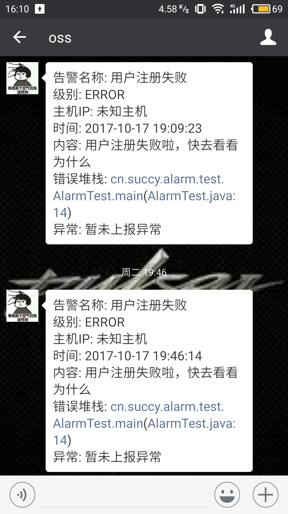
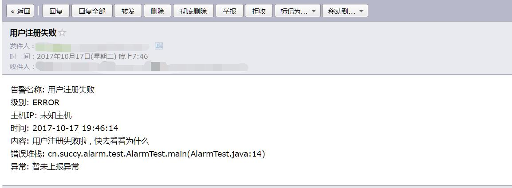

# 应用告警系统
## 背景
在软件开发过程中，出现异常是不可避免的，除了一般的异常之外，当用户触发某些条件时，我们开发和运维人员如果想要感知的话是很困难
的，因为我们的程序并不会主动告诉我们发生了什么事情，通常只会以日志的形式记录下来。如果是一个比较紧急的错误，我们需要立即修复
的话，通常情况下，如果没有一个比较好的机制能及时通知开发和运维人员，我们很难做到第一时间做出判断，程序哪里出现异常，出现的是
什么异常……因此，本系统就是为了解决这个问题的。

打个比方说，假如数据库的连接池的连接数量是有限的，然而在开发过程中需要手动close来释放连接的时候，由于程序猿小哥的粗心，导致
忘记释放连接，程序也一样可以运行，但是，由于某个时间段的并发量很大，导致数据库中可用的连接越来越少，直到为0，然而之前获得连
接的线程又没能释放不用了的连接，这个时候，新进来的线程因为得不到数据库连接对象，一直等待，最后抛异常，但是由于没有报警机制，
使得程序猿小哥一直不知道，直到用户反馈网站显示不出数据的时候，再去排查，这个时候才发现这个问题，但是已经造成了很大的损失。
## 系统概况
目前系统支持用在各种java应用中，包括分布式应用，用法也很简单，只不过分布式应用和普通应用有所不同，这个稍后会讲到。同时，支持
微信企业号的推送和邮箱推送，本来也提供短信服务的，但是由于短信成本较高，一般报警较为频繁的话，会开销过大，因此只提供了接口，
若是后期真的需要，再做调整了。对于发送者，本系统提供两种方式来配置，一种是基于json配置文件的配置方式，就是将要接收的人的信息
在配置文件中配置好，那么就可以读取这些配置文件中的联系人进行发送。另外一种是使用数据库作为存储介质，将联系人的信息存储在数据
库中，程序自动读取对应的jdbcurl的数据库中表的信息进行发送。

对于发送的消息，自定义编写模板，只需将系统发送过程中注入的报警相关变量参数填充到模板即可。具体用法再稍后会提及。
## 系统截图
微信截图


邮箱截图


## 使用方法
在需要发送报警的地方，直接调用Alarm.error()等一系列方法即可，对于分布式而已，用法稍有不同，等后面支持了再做补充！下面给上Alarm中
的可用报警方法:
```java
public static void info(String alarmName, String content) {
    info(alarmName, content, null);
}

/**
 * info级别警报
 *
 * @param alarmName 警报名称
 * @param content   警报内容
 */
public static void info(String alarmName, String content, Throwable e) {
    send(Level.INFO, alarmName, content, e);
}

public static void debug(String alarmName, String content) {
    debug(alarmName, content, null);
}

/**
 * debug级别警报
 *
 * @param alarmName 警报名称
 * @param content   警报内容
 */
public static void debug(String alarmName, String content, Throwable e) {
    send(Level.DEBUG, alarmName, content, e);
}

public static void warn(String alarmName, String content) {
    warn(alarmName, content, null);
}

/**
 * warn级别警报
 *
 * @param alarmName 警报名称
 * @param content   警报内容
 */
public static void warn(String alarmName, String content, Throwable e) {
    send(Level.WARN, alarmName, content, e);
}

public static void error(String alarmName, String content) {
    error(alarmName, content, null);
}

/**
 * error级别警报
 *
 * @param alarmName 警报名称
 * @param content   警报内容
 */
public static void error(String alarmName, String content, Throwable e) {
    send(Level.ERROR, alarmName, content, e);
}

```

## 配置文件详解
全局的配置文件分为三类，一类是系统运行需要的一些配置项信息，也是主配置文件，叫alarm.properties，另外，还有一个是关于消息模板的
模板文件，名字是随意的，存放的路径也不强制要求一定在classpath下，可以是磁盘的任意位置，只需要在alarm.properties中配置即可。第三
种是接收者的配置文件，当然了，如果采用的是数据库存储，这个也不用关心了，接下来看看alarm.properties，就会一目了然了。
```properties
# 配置报警系统名称，一旦配置之后，在邮件发送时，别名就是系统的名称，默认就是报警系统
alarm.name=Succy报警系统

# 消息模板，可以自定义，如果不配置，默认使用classpath:template/message.tpl
# 同时还支持绝对路径
# alarm.template=classpath:template/message.tpl

## 默认开启的线程池线程数量
alarm.thread.pool.size=10
# 配置报警发送器，目前支持邮箱(email), 微信(wechat)，配置多个时，通过逗号分隔
alarm.sender=wechat,email

# 提供者配置
# 配置联系人存储方式，目前支持两种，一种是json配置文件，一种是jdbc
alarm.provider.type=jdbc
# 如果联系人存储方式配置的是Json,那么配置文件存储位置一定要配置.可以配置绝对路径和相对路径，如果是相对路径，会
# 默认到classpath下寻找,也支持类似Spring的风格，例如classpath:conf/xxx.json
alarm.provider.jsonfile.path=classpath:conf/contacts.json
# 如果配置了存储方式为jdbc，那么数据库相关配置一定要配置
alarm.provider.jdbc.username=
alarm.provider.jdbc.password=
alarm.provider.jdbc.url=jdbc:mysql://localhost:3306/alarm?characterEncoding=utf-8&useSSL=false

## 邮件发送相关配置
# 邮箱登录用户名
alarm.email.username=

# 邮箱登录密码
alarm.email.password=

# SMTP服务器
alarm.email.hostname=smtp.sina.com

# SMTP端口
alarm.email.port=25

alarm.email.charset=utf-8

# 是否启用ssl
alarm.email.ssl=false
alarm.email.ssl.port=443

## 微信相关配置
# 企业号的企业id
alarm.wechat.corpid=
# 报警应用的密钥
alarm.wechat.corpsecret=
# 企业应用的id，整型。可在应用的设置页面查看
alarm.wechat.agentid=

# 微信发送的消息要接收的部门id，支持多个，用|分隔
# 由于在这里，我们配置了发送者的微信id，因为，可以不使用部门接收
# 如果需要对整个部门的人都接收的话，开启下面的配置项
# alarm.wechat.partyid=2
```
结合着上面的配置文件，简单说一下，一个是线程池，为什么会出现线程池呢？因为，报警系统属于旁路系统，理论上是不应该影响业务
系统的运行的，那么这一块就应该是异步的。如果采用发送一次报警就构造一个线程的方式的话，那么，对于系统而言，开销会过大，为了
使得线程资源可以重复利用，这里面的实现采用了线程池，可以由使用者配置线程数来满足需求。
另外，不管接收者采取怎么样的方式存储，都只需通过一个简单的配置即可切换，详细请看上面。如果需要配置jdbc的方式，请将resources
下的sql/alarm.sql导入数据库即可。

### 关于联系人的配置
其实，不管是json还是数据库，采用的原理都是一样的。首先，在json配置中，我们会有一个receivers的键，在数据库中是一张receivers
的表，这个就是要接收的接收者，在json文件中，它是一个数组的存在，里边存放的是接收组的名称。
下面先看看几个概念的定义：

接收组：接收组是什么一个概念呢？就是把联系人分组，比如说，数据库中有一张contacts的表，里边存放有各个联系人的相关信息，那么接收
组就是将这些联系人进行分组，好比开发一组，有张三，李四，王五。运维一组有陈大，王二，张小明等。保存的是联系人的id，接收组还有自己的id和名字。
联系人：顾名思义，就是一些成员的信息集合，里面可以配置他们的手机号(为后面短信发送做准备而已),邮箱，企业微信id等信息。

根据上面的定义，那么就很容易理解receivers的配置了，其实就是将要接收报警信息的组的名字配置进去，系统就会对这些组的人员进行一一发送。
下面奉上contacts.json的配置项，其实名字也是随意的，在配置文件配置西下就好了，请详细看上面的alarm.properties就好
```json
{
  "receivers": [
    "运维1组"
  ],
  "groups": [
    {
      "group_id": "1",
      "group_name": "运维1组",
      "contacts": [
        "1",
        "2"
      ]
    }
  ],
  "contacts": [
    {
      "contact_id": "1",
      "name": "succy",
      "email": "succy@qq.com",
      "phone": "130*****63",
      "wechat": "succy"
    },
    {
      "contact_id": "2",
      "name": "xiaoqiang",
      "email": "qiang@qq.com",
      "phone": "13*****63",
      "wechat": "qiang"
    }
  ]
}
```
由于alarm.properties和contacts.json都配置了一些私人的信息，那么在github就不提交这两个文件了，使用的时候，直接复制readme.md这里的
进行自己拓展，除了alarm.properties要放置在classpath之外，其他的两个配置都不需要，只需在alarm.properties里边配置好它们的路径即可。

### 关于消息模板的配置
消息模板使用的是JFinal的Enjoy模板引擎，因此，只需要符合Enjoy的语法即可。在模板文件读取时，以下几个参数会被注入：
alarmName、level、host、dateTime、content、traceStack、exception，其中，JFinal的StrKit也会被注入其中，这个类的所有方法都可以在
模板中使用，下面奉上一个默认的模板：
```
#--
    警报模板
    该模板不局限与使用message.tpl这个名字，可以任意名字，
    模板引擎使用Jfinal Enjoy模板，在模板中，可以使用Enjoy的语法进行编写
--#
告警名称: #(alarmName)
级别: #(level)
主机IP: #(StrKit.notBlank(host) ? host : "未知主机")
时间: #(dateTime)
内容: #(content)
错误堆栈: #(traceStack)
异常: #(StrKit.notBlank(exception) ? exception : "暂未上报异常")
```

## 分布式集成
在分布式这一块，本人打算使用MQ进行解耦，报警系统和业务系统相互之间是透明的，它们之间通过MQ进行通信，这一块目前还没有提供，敬请期待！
